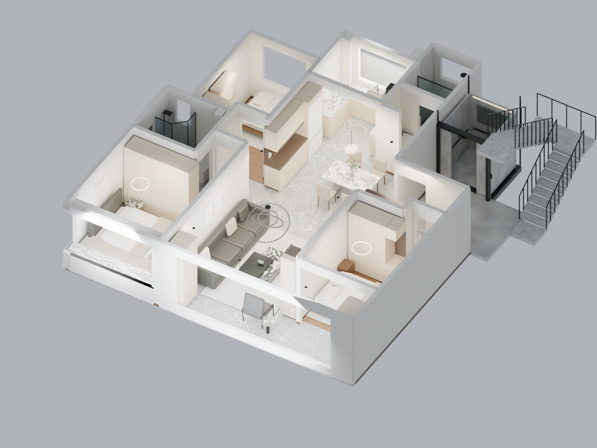

# Guanshanyue 室内模型

室内三维模型与第一人称漫游展示，仅保留最终模型、效果图和网页。

**[在线访问](https://seanwong17.github.io/guanshanyue-interior/)** · [Blender 模型](output/apartment_v1.blend) · [GLB 模型](output/apartment_v1.glb)



本项目参考了 [Panorama Static Viewer](https://github.com/SeanWong17/panorama-static-viewer) 的室内全景展示与空间浏览方式，并使用其示例公寓全景资料辅助建模核对；采用可编辑的 Blender 模型和 Three.js 三维漫游展示。

## 最终成果

模型采用浅米色柜体（`#d5c5ad`）、深棕木纹（`#544539`）和灰底白纹地砖（`#a2a4a1`），卧室保留木地板。颜色为照片近似值；网页显示基础色，程序木纹及石材纹理以 Blender 渲染为准。

`output/` 包含 Blender 源模型、网页使用的 GLB 和以下 13 张效果图。模型文件名保留为 `apartment_v1`，以兼容现有下载地址。

| 全屋与公共区 | 起居空间 | 卧室与厨卫 |
| --- | --- | --- |
| [全屋鸟瞰](output/01_whole_home.png) | [客厅](output/03_living.png) | [主卧](output/05_master.png) |
| [完整俯视](output/02_floor_plan.png) | [餐厅](output/04_dining.png) | [北次卧](output/07_north_bedroom.png) |
| [电梯与楼梯](output/18_public_hall.png) | [入户玄关](output/06_entry.png) | [南次卧](output/08_south_bedroom.png) |
| | [洗衣区](output/11_laundry.png) | [客卫](output/09_guest_bath.png) |
| | [厨房](output/12_kitchen.png) | [主卫](output/13_master_bath.png) |

## 本地运行

需要 Node.js 22 或更新版本。

```sh
npm ci
npm run dev
```

打开 http://localhost:5186/ 。首次访问需下载约 17 MB 的三维模型。

`npm run build` 生成静态站点到 `dist/`；`npm run preview` 预览构建结果。推送 `main` 后通过 GitHub Actions 自动部署到 GitHub Pages。

浏览器验收：执行 `npx playwright install chromium`，启动预览服务，再执行 `npm run test:browser`。检查桌面与手机视口的模型显示、图层开关和漫游操作；可通过 `PREVIEW_URL` 指定地址。验收截图和报告不纳入版本控制。

## 浏览与漫游

拖动画面旋转模型，使用房间按钮切换视角，使用显示开关查看墙体、吊顶、柜体、门窗与窗帘等图层。

点击“漫游”从客厅进入。W/A/S/D 或方向键移动，拖动画面转头；电脑可点击鼠标图标锁定视角，Esc 释放。手机使用左下方向按钮移动。小地图的红点表示位置，绿色箭头表示朝向。视线高度默认 1.60 m，速度默认 1.2 m/s，均可调整。房间菜单可切换起点；“整体”或退出图标恢复进入前的视角和吊顶设置。

漫游限定本层住宅地板，不支持上下楼梯。碰撞使用可见物体的简化包围盒，复杂家具附近可能留出较保守的间距；隐藏物体不阻挡通行，显示且关闭的门扇会阻挡通行。

## 模型说明

模型用于空间、柜体和效果审阅，不作为施工下单文件。建筑层高为确认的 2900 mm；净高、吊顶、柜体、厨卫及公共区部分尺寸仍为估算。主卧床垫为 1800 × 2000 mm，两张次卧床垫为 1500 × 2000 mm。餐边柜内收涉及墙体凹位，需现场确认墙体性质；尚未完成全部门柜开启、通行和施工公差验证。

Blender 模型内已打包参考图片。`02_Ceilings` 为吊顶，`06_WindowsCurtains` 为门窗，`11_Curtains` 为窗帘，`10_PublicHall_SCHEMATIC` 为公共区。
